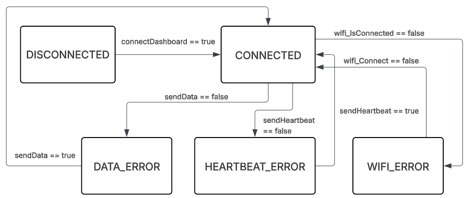

# Boardom Arduino

An Arduino-based C++ application, that can connect to a remote dashboard. It will send data to a remote Database via a custom API.

---

## Data

The Arduino is able to transmit these data:

- Temperature
- Humidity
- Pressure
- Light
- Moisture (If the ST0160 is connected on a pin)

## Config.h File

The Arduino works on a **config.h** file. This file has to look like this with these exact constants

```
#include <Arduino.h>

const bool USING_CARRIER_CASE = false;

const char WIFI_SSID[] = "";
const char WIFI_PASS[] = "";

const char API_SERVER_IP[] = "";
const char DASHBOARD_SERVER_IP[] = "";
const uint16_t DASHBOARD_PORT = 0;
const uint16_t API_PORT = 0;

const uint32_t DATA_INTERVAL_MS = 30000; // Every 30 seconds
const uint32_t WIFI_CHECK_INTERVAL_MS = 60000; // Every 60 seconds

const bool USING_ST0160 = false;
const uint8_t ST0160_PIN = A0;
```

## Architecture Overview

The application is built as a **state-machine** 
This makes it easy to define what is currently happening and what each button should do. 

Using states allows the ability to use the same buttons for many different things by checking the state 
before handling a button click

---

## States

Below is an overview of the states used in the system.


### `DISCONNECTED`
**Purpose:**  
- This state will show a "Disconnected" screen
- User can press a button to connect to server specified in **config.h**

---

### `CONNECTED`
**Purpose:**  
- The device is connected to the remote dashboard
- Will show data on the inbuilt screen
- Can show settings if clicked
- Will periodically transmit data to remote database

---

### `HEARTBEAT_ERROR`
**Purpose:**  
- The device enters this state if the heartbeat fails
- User can press a button to retry the heartbeat

---

### `DATA_ERROR`
**Purpose:**  
- The device enters this state if data-transmission failed
- User can press a button to retry the data transmission

---

### `WIFI_ERROR`
**Purpose:**
- The device enters this state if it suddenly loses WiFi connection
- User can press a button to retry connection

---

### `ERROR`
**Purpose:**  
- This state is for any other error
- Is not currently used

---

## State Diagram


